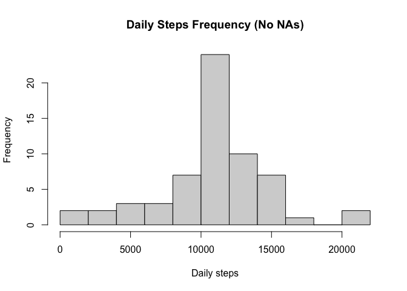

The following code represents a submission for the assignment "Peer Assessment 1" of the Coursera course "Reproducible Research".

The following code loads all relevant packages and ensures all code chunks will be displayed, allowing peers to review:


```r
library(knitr)
library(stringr)
library(scales)
library(lattice)
opts_chunk$set(echo = TRUE)
```

## Loading and preprocessing the data

The data to be leveraged for the assignment is the "activity.csv" file, included in this repository. The following code will load and clean the dataset.


```r
data <- read.csv("activity.csv")
data$date <- as.Date(as.character(data$date), format = "%Y-%m-%d")
# Add a variable "intstart" indicating in time format when interval begins
data$intstart <- str_pad(data$interval, width = 4, pad = "0")
data$intstart <- as.POSIXlt(data$intstart, format = "%H%M", tz = "GMT") 
data$intstart <- strftime(data$intstart, format="%H:%M", tz = "GMT")
# Summarize data
summary(data)
```

```
##      steps             date               interval        intstart        
##  Min.   :  0.00   Min.   :2012-10-01   Min.   :   0.0   Length:17568      
##  1st Qu.:  0.00   1st Qu.:2012-10-16   1st Qu.: 588.8   Class :character  
##  Median :  0.00   Median :2012-10-31   Median :1177.5   Mode  :character  
##  Mean   : 37.38   Mean   :2012-10-31   Mean   :1177.5                     
##  3rd Qu.: 12.00   3rd Qu.:2012-11-15   3rd Qu.:1766.2                     
##  Max.   :806.00   Max.   :2012-11-30   Max.   :2355.0                     
##  NA's   :2304
```

## What is mean total number of steps taken per day?

Create a table summarizing total number of steps taken per day


```r
dailysteps <- tapply(data$steps, data$date, sum)
```

Make a histogram of the total number of steps taken each day


```r
hist(dailysteps, 10, xlab = "Daily steps", main = "Daily Steps Frequency")
```

<!-- -->

Calculate and report the mean and median of the total number of steps taken per day


```r
meansteps <- format(round(mean(dailysteps, na.rm = T)), big.mark = ",")
mediansteps <- format(median(dailysteps, na.rm = T), big.mark = ",")
```

The mean of daily steps is **10,766**  
The median of daily steps is **10,765**

## What is the average daily activity pattern?

Calculate and make a time series plot of the 5-minute interval (x-axis) and the average number of steps taken, averaged across all days (y-axis)


```r
intsteps <- tapply(data$steps, data$intstart, mean, na.rm = T)
plot(intsteps, type = "l", xaxt="n", xlab = "Time", ylab = "Steps", main = "Average steps by time of day")
axis(1, at = seq(1,289, 48), labels = c(names(intsteps)[seq(1,288,48)],"00:00"))
```

<!-- -->

Calculate which 5-minute interval, on average across all the days in the dataset, contains the maximum number of steps:


```r
maxsteps <- round(tail(intsteps[order(intsteps)],1))
maxintstart <- names(tail(intsteps[order(intsteps)],1))
maxintend <- names(intsteps)[grep(maxintstart, names(intsteps))+1]
maxint <- paste(maxintstart, "-", maxintend)
```
The interval with the highest average number of steps is **08:35 - 08:40** with an average of **206** steps

## Imputing missing values

Calculate and report the total number of missing values in the dataset (i.e. the total number of rows with NAs)


```r
narows <- sum(is.na(data))
percna <- percent(narows / nrow(data))
```

The dataset includes **2304 NA rows**, which account for **13%** of the dataset

In order to fill in all missing values, we will substitute them with the mean for the 5-minute interval on all other days. A new dataset is created with the missing data filled in:


```r
datafull <- data
datana <- is.na(data$steps)
datafull[datana,1] <- intsteps[(data[datana,4])]
```
Using the new dataset, build a histogram of total number of steps each day, as well as mean and median total number of steps taken per day:


```r
dailystepsnew <- tapply(datafull$steps, datafull$date, sum)
hist(dailystepsnew, 15, xlab = "Daily steps", main = "Daily Steps Frequency (No NAs)")
```

<!-- -->

```r
meanstepsnew <- format(round(mean(dailystepsnew, na.rm = T)), big.mark = ",")
medianstepsnew <- format(round(median(dailystepsnew, na.rm = T)), big.mark = ",")
```
The mean of daily steps, after filling NAs, is **10,766**  
The median of daily steps, after filling NAs, is **10,766**

These value do not differ from the estimates calculated in the previous part of the assignment, therefore transforming missing values has a very limited impact on the results of the analysis.

## Are there differences in activity patterns between weekdays and weekends?

Create a new factor variable in the dataset with two levels -- "weekday" and "weekend" indicating whether a given date is a weekday or weekend day:


```r
weekmap <- c("Mon" = "weekday", "Tue" = "weekday", "Wed" = "weekday", "Thu" = "weekday", "Fri" = "weekday", "Sat" = "weekend","Sun" = "weekend")
datafull$dayofweek <- weekmap[weekdays(datafull$date, abbreviate = T)]
```


Make a panel plot containing a time series plot (i.e. type = "l") of the 5-minute interval (x-axis) and the average number of steps taken, averaged across all weekday days or weekend days (y-axis):


```r
dailystepsweek <- aggregate(steps ~ interval + dayofweek, data = datafull, FUN = mean)
xyplot(steps ~ interval | dayofweek, data = dailystepsweek, type = "l", layout = c(1, 2), xlab = "Interval", ylab = "Steps", main = "Average steps on weekend and weekday", scales = list(x = list(at = quantile(dailystepsweek$interval), labels = c("00:00", "06:00", "12:00", "18:00", "00:00"))))
```

<!-- -->

Weekend steps are generally lower than weekday steps, as well as more concentrated in the afternoon hours.
